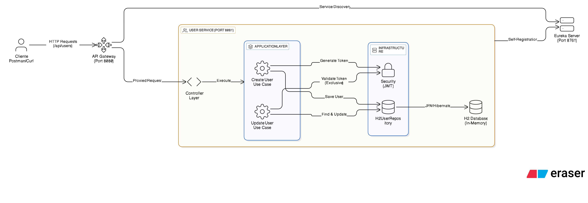

# Reto Java NTT Data - Sistema de Gestión de Usuarios

Este proyecto implementa una solución de microservicios para la gestión de usuarios, cumpliendo con los requisitos de una arquitectura distribuida utilizando **Spring Boot** y **Spring Cloud**.

## 📋 Lista de Componentes

La solución se divide en tres artefactos principales desplegados independientemente:

1.  **Service Registry (Eureka Server):** Servidor de descubrimiento donde se registran los microservicios activos.
2.  **API Gateway:** Puerta de entrada única que redirige el tráfico hacia los servicios correspondientes y actúa como balanceador de carga.
3.  **User Service:** Microservicio *core* que contiene toda la lógica de negocio, validaciones, seguridad JWT y persistencia de datos.

### 🛠️ Stack Tecnológico

* **Lenguaje:** Java 21
* **Framework Principal:** Spring Boot 4.0.0
* **Arquitectura:** Spring Cloud (Gateway, Netflix Eureka)
* **Seguridad:** Spring Security + JWT (JSON Web Tokens)
* **Base de Datos:** H2 Database (En memoria)
* **Persistencia:** Spring Data JPA (Hibernate)
* **Documentación:** SpringDoc OpenAPI (Swagger UI)
* **Build Tool:** Gradle
* **Calidad de Código:** SonarQube

---

## 🏗️ Diagrama de Arquitectura

La solución sigue un patrón de API Gateway con Service Discovery. El *User Service* implementa una **Arquitectura Limpia** (Clean Architecture) separando Dominio, Aplicación e Infraestructura.



---

## 🚀 Guía de Instalación y Ejecución

### Prerrequisitos
* JDK 17 instalado.
* Conexión a internet para descargar dependencias de Gradle.

### ⚠️ Orden de Ejecución (Importante)
Para que la orquestación funcione correctamente, los servicios deben levantarse en el siguiente orden estricto:

1.  **Service Registry** (Puerto 8761)
2.  **User Service** (Puerto 8081)
3.  **API Gateway** (Puerto 8080)

### Pasos para levantar el proyecto

No es necesario instalar una base de datos externa ni ejecutar scripts SQL manuales. **La base de datos H2 se autogenera en memoria** al iniciar la aplicación gracias a la configuración `ddl-auto: update` de JPA.

#### 1. Levantar Service Registry
```bash
cd registry-service
./gradlew bootRun
# Esperar a que inicie completamente en http://localhost:8761
```

#### 2. Levantar User Service
```bash
cd user-service
./gradlew bootRun
# Esperar a que se registre en Eureka
```

#### 3. Levantar API Gateway
```bash
cd gateway-service
./gradlew bootRun
# Disponible en http://localhost:8080
```

## 📄 Documentación de API (Swagger)
La documentación interactiva de los endpoints está disponible directamente en el microservicio de usuarios.

### Captura de Swagger UI

## ✅ Calidad de Código (SonarQube)
El proyecto ha sido analizado estáticamente para garantizar la calidad, seguridad y mantenibilidad del código.

### Captura de Reporte SonarQube

## 🧪 Pruebas de Endpoints

El acceso público se realiza a través del API Gateway (Puerto 8080).

### Crear Usuario
```curl
curl -X POST http://localhost:8080/api/users \
  -H "Content-Type: application/json" \
  -d '{
    "name": "Juan Perez",
    "email": "juan.perez@dominio.cl",
    "password": "Password123",
    "phones": [{"number": "1234567", "cityCode": "1", "countryCode": "57"}]
}'
```

